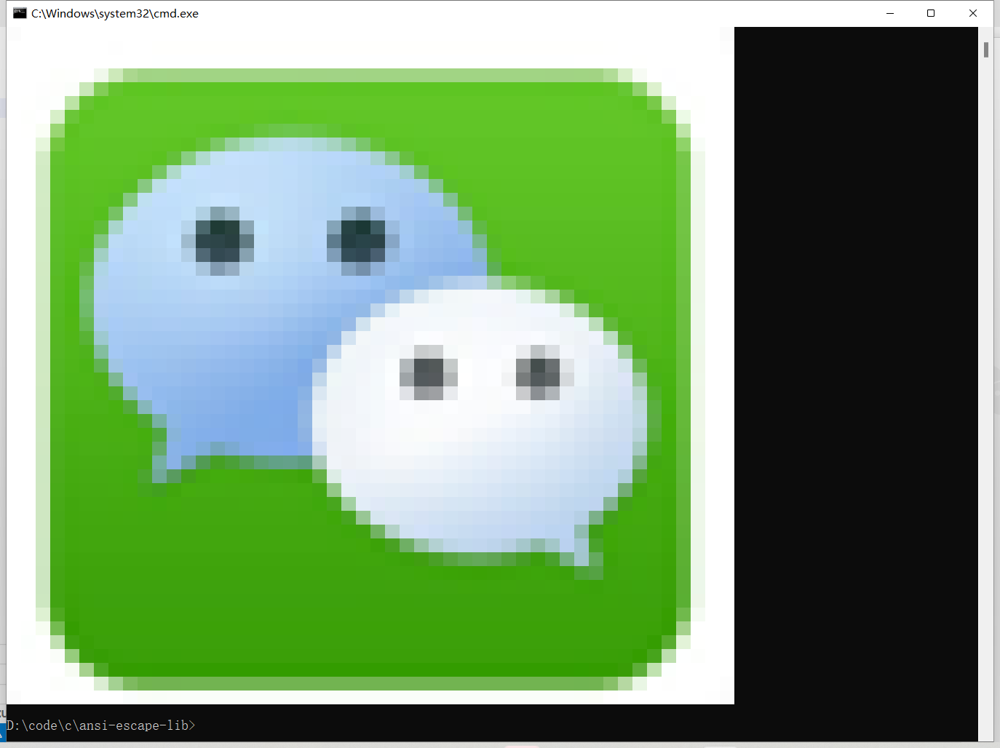
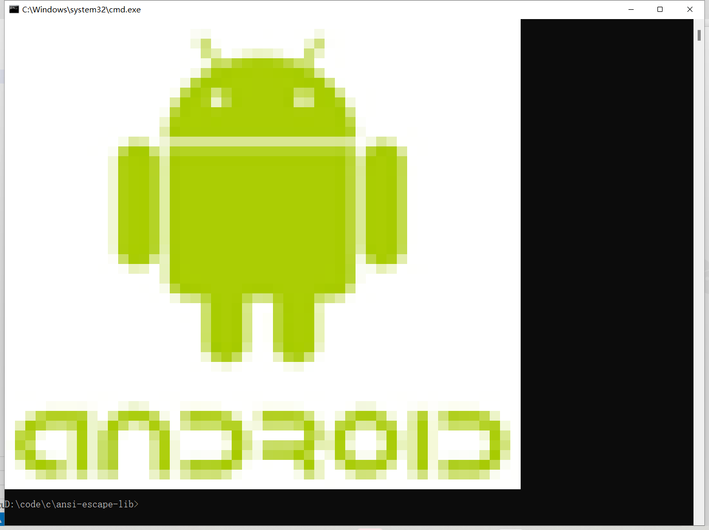
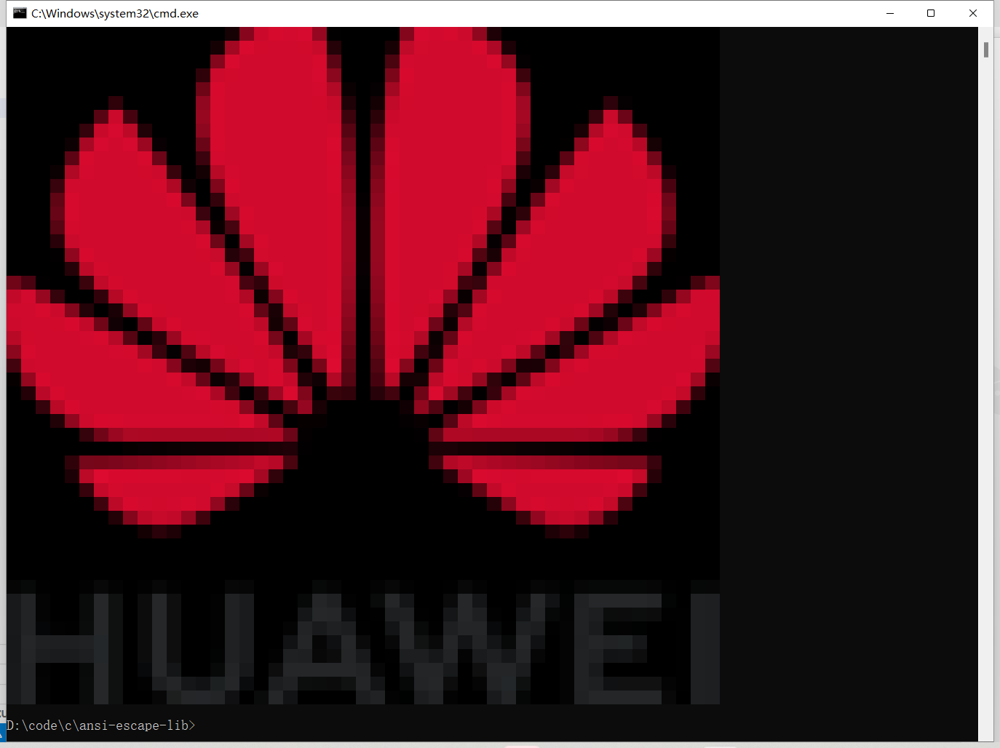
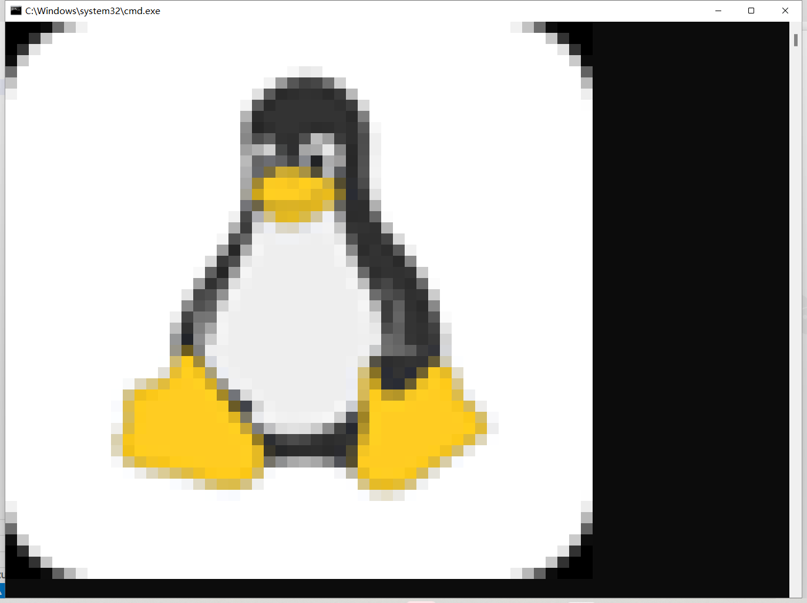
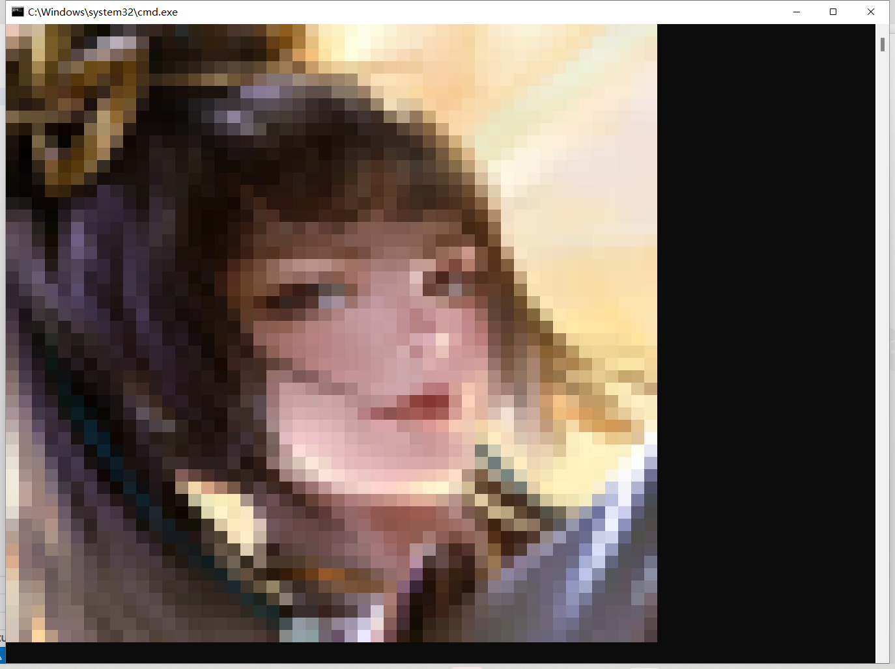
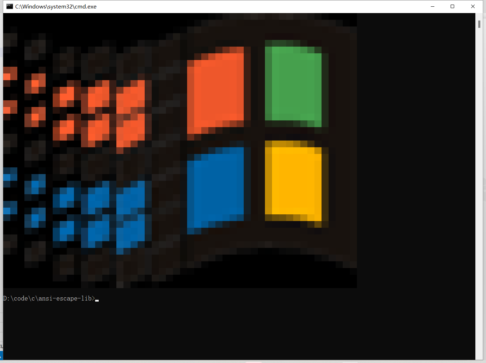
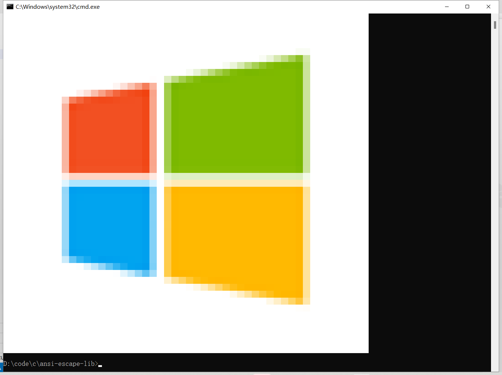
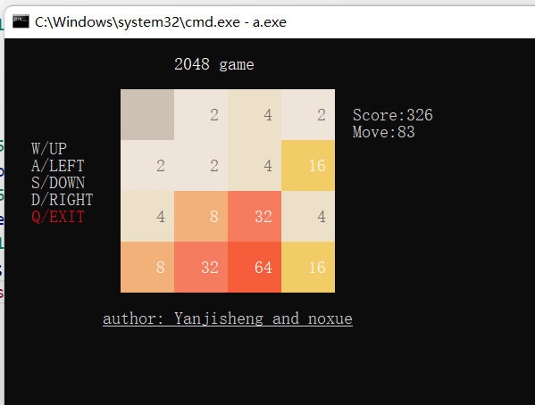

## ansi-escape-lib

ansi-escape-lib 是一个简单的 ansi escape 库，它可以用于在终端上打印 ansi escape 码，

参考：<https://en.wikipedia.org/wiki/ANSI_escape_code>

ansi escape 封装，方便控制命令行颜色和光标

# 使用方法

**极其简单，一步到位**

【把 ansi.h 和 ansi.c 复制到自己项目，并引入 ansi.h】

兼容 gcc 和 vs

# 例子

### 基本用法

```
gcc -o demo.exe examples/demo.c ansi.c
```

### 图片转字符画

imgs.c 显示图片，imgs.h 图片头文件，保存了图片的 rgb 数组，可以直接使用

#### 图片转 c 语言 rgb 数组

imgs.h 是使用这个项目 <https://github.com/noxue/img2rgb> 来生成的 c 语言数组

- 编译命令

  ```
  gcc -o imgs.exe examples/imgs.c ansi.c
  ```

- 运行命令

  - 执行命令如果不带参数，会提示你可以输入哪些参数

  ```
  ./imgs.exe
  ```

  - 比如显示 qq 图片

  ```
  ./imgs.exe qq
  ```

#### 效果图

















## 2048 游戏效果

### 编译命令

```
gcc -o 2048.exe examples/2048.c ansi.c
```


